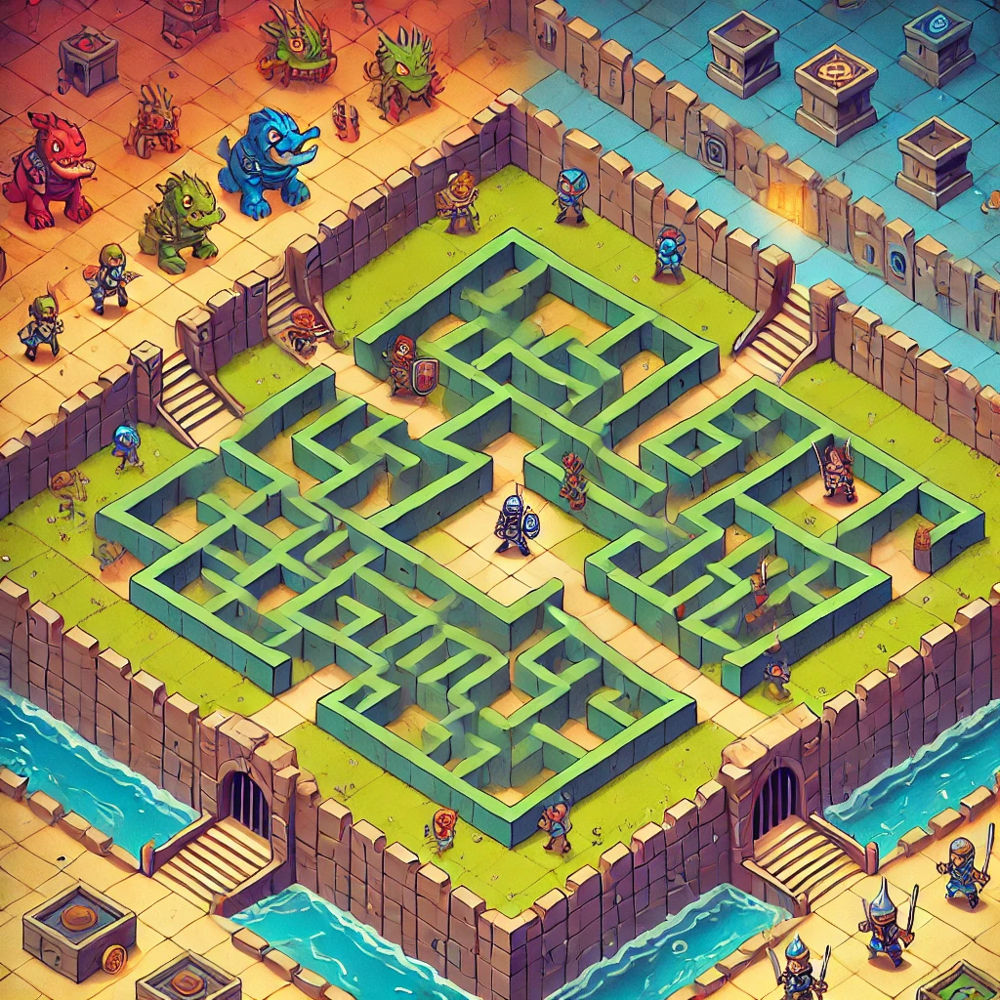

# Irrgarten

**Irrgarten** es un juego de aventura y estrategia en el que los jugadores deben escapar de un laberinto lleno de obstáculos, monstruos y peligros. En este juego, varios jugadores competirán por llegar a la salida del laberinto primero, mientras sortean trampas y combaten monstruos. ¡Solo el jugador más astuto y fuerte logrará escapar!

## Tabla de Contenidos

1. [Descripción del Juego](#descripción-del-juego)
2. [Reglas del Juego](#reglas-del-juego)
3. [Atributos de los Jugadores](#atributos-de-los-jugadores)
4. [Laberinto y Casillas](#laberinto-y-casillas)
5. [Combates](#combates)
6. [Monstruos](#monstruos)
7. [Resurrección y Muertes](#resurrección-y-muertes)
8. [Armas y Escudos](#armas-y-escudos)
9. [Cómo Jugar](#cómo-jugar)
10. [Instalación y Ejecución](#instalación-y-ejecución)
11. [Contribuir](#contribuir)

## Descripción del Juego

Irrgarten es un juego de laberintos en el que los jugadores deben escapar de un tablero de juego lleno de casillas que pueden estar ocupadas por obstáculos, monstruos o libres para moverse. Los jugadores deben desplazarse hacia la casilla de salida, pero tendrán que enfrentarse a monstruos, obstáculos y otros jugadores en el camino. El primero en llegar a la salida será el ganador.

## Reglas del Juego

- El tablero de juego es un laberinto rectangular o cuadrado, dividido en casillas.
- Los jugadores empiezan en posiciones aleatorias.
- El objetivo es llegar a la casilla de salida antes que los demás jugadores.
- Los jugadores se mueven a casillas adyacentes en línea recta (no se permite movimiento diagonal).
- Algunas casillas tienen obstáculos y no pueden ser pisadas.
- Las casillas que contienen monstruos pueden ser peligrosas: al pisarlas, se inicia un combate.
- El jugador que muera en combate será resucitado con una probabilidad definida.

## Atributos de los Jugadores

Cada jugador tiene los siguientes atributos:

- **Inteligencia**: Determina la fuerza defensiva.
- **Fuerza**: Determina la fuerza de ataque.
- **Salud**: Si llega a 0, el jugador muere.
- **Armas**: Las armas se suman a la fuerza de ataque del jugador.
- **Escudos**: Los escudos suman a la defensa del jugador.

## Laberinto y Casillas

El laberinto está formado por casillas que pueden estar:

- **Libres**: Los jugadores pueden moverse a estas casillas.
- **Obstáculos**: Casillas que bloquean el paso.
- **Monstruos**: Los monstruos ocupan casillas libres y no la salida. Si un jugador se encuentra con un monstruo, se inicia un combate.
- **Salida**: Casilla que marca el final del laberinto y que no puede estar ocupada por un obstáculo.

## Combates

Cuando un jugador llega a una casilla ocupada por un monstruo, se inicia un combate. Las reglas del combate son las siguientes:

1. El jugador ataca primero, seguido por la defensa del monstruo.
2. El ataque y la defensa se basan en los atributos del jugador (fuerza y armas) y del monstruo (inteligencia y fuerza).
3. Cada combate puede durar hasta 10 rondas, o hasta que uno de los participantes muera.
4. Si el jugador recibe 3 heridas consecutivas, pierde el combate.
5. Los combates tienen un resultado aleatorio en cuanto a la fuerza de ataque y defensa.

## Monstruos

Los monstruos son enemigos inmóviles en el tablero y tienen:

- **Fuerza de Ataque**: Un número aleatorio entre 0 y su nivel de fuerza.
- **Fuerza Defensiva**: Un número aleatorio entre 0 y su nivel de inteligencia.
- **Salud**: Si la salud del monstruo llega a 0, muere.

## Resurrección y Muertes

- Si un jugador muere, no podrá moverse a otras casillas.
- Los jugadores muertos tienen una probabilidad de ser resucitados al recibir su siguiente turno.
- Cuando un jugador muere, está obligado a compartir la casilla con un monstruo, transformándola en un obstáculo.

## Armas y Escudos

- **Armas**: Aumentan la fuerza de ataque del jugador. Tienen un número limitado de usos.
- **Escudos**: Aumentan la defensa del jugador. También tienen un número limitado de usos.
- **Descarte Automático**: Cuando un jugador recibe un nuevo arma o escudo, puede decidir descartar aquellos que estén cerca de agotarse, basándose en el número de usos restantes.

## Cómo Jugar

1. **Comienza el juego**: Cada jugador se coloca aleatoriamente en el laberinto.
2. **Realiza tu movimiento**: Mueve hacia una casilla libre adyacente.
3. **Evita los monstruos**: Si caes en una casilla ocupada por un monstruo, deberás luchar.
4. **Gana el combate**: Si derrotas al monstruo, recibirás armas, escudos y una mejora en tu salud.
5. **Llega a la salida**: El primer jugador que llegue a la casilla de salida gana la partida.

---

- **Autor:** José Ángel Carretero Montes
